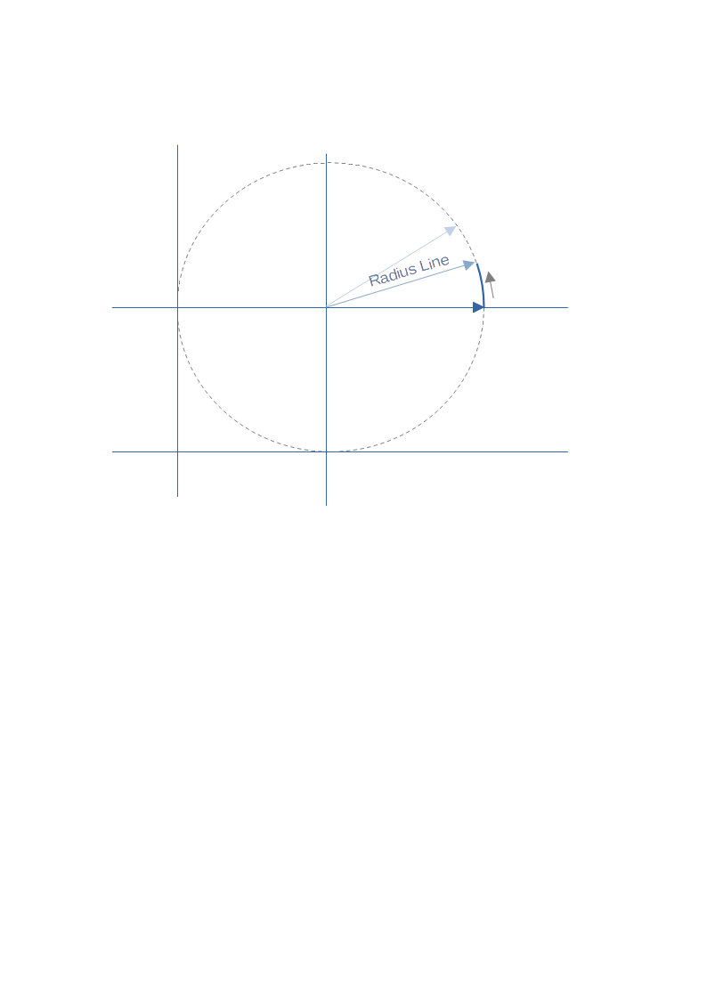

## Introduction
This folder contains some simple examples using Python Turtle to draw various simple graphics.

The software was written on a Windows PC using Python v3.8.1

## PlotCircle
This program shows the basics of using Turtle to draw a static image.

