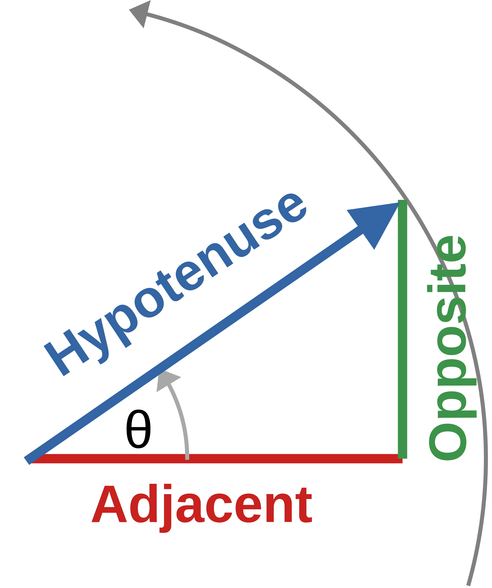
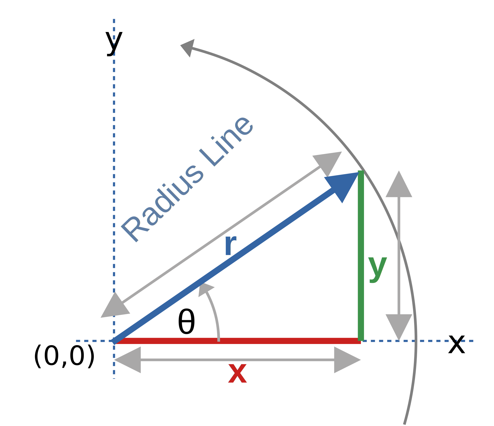

## Introduction
This folder contains some simple examples using Python Turtle to draw various simple graphics.

The software was written on a Windows PC using Python v3.8.1

## PlotCircle
This program shows the basics of using Turtle to draw a static image.

If you take a *point* in a **Cartesian Plane** (eg 2 dimensional graph with x,y axes), let that point be the **"Origin"** (x=0,y=0), then draw a straight line outwards from it - call it the **"radius"**, keep one end of the line **fixed** at the *Origin*, and then sweep the *radius* around through 360 degrees - the other end of the line (not fixed to the Origin), will draw out a ***circle***.

The diagram below demonstrates a radius being drawn along the positive x axis, and then swept around the *Origin* anti-clockwise.

Consider the diagram **below**...

The ***radius*** can be seen as the **Hypotenuse** of a triangle.  That triangle can be formed with two sides that are parallel to the **x** and **y** axes of the plane.  The x-axis and y-axis "sides" form a **right-angle triangle** with the *hypotenuse*.

The angle **theta** is the angle relative to the **x-axis** that the **radius** makes, as it sweeps around to form the circle.

The side on the *x* axis, relative to the angle *theta*, is known as the **Adjacent** side (in basic trigonometry.)  Similarly, the side on the *y* axis, is known as the **Opposite** side.

In **trigonometry** we can redefine the side's names as:

Where
- **Hypotenuse** = **r**
- **Adjacent** = **x**
- **Opposite** = **y**

Trigonometry tells us that:

and 

These both now give us values for **x** and **y**, in parametric form using the angle *theta* as the *independent parameter*:

***Now we have the math for plotting a circle***, all that remains now is the ***implementation***.

Using **Turtle Graphics** we can create the circle as follows:
1. start at some point on the circle
1. set a new *target* point at some point further along the circles edge
1. draw a line to the target

There are some other options, why not use them?
1. Plot dots around the edge of the circle - there will be gaps between the dots, meaning a large circle will need a large number of dots.  Since *Turtle* can draw lines, we take advantage of that
1. Use a different equation expressed directly in terms of *x* and *y* - we would need to make the equation in terms of either x or y (we'll pick *x*), then to calculate the points to draw, we would need to increment *x*.  But this will lead to big gaps between target points where x is close to zero, and tiny gaps where x is close to the length of the radius - this is due to the curvature of the circle.
Using the *parametric equation* with the angle *theta* as the independent parameter, leads to the same spacing between every target point and thus a "better looking" circle.
